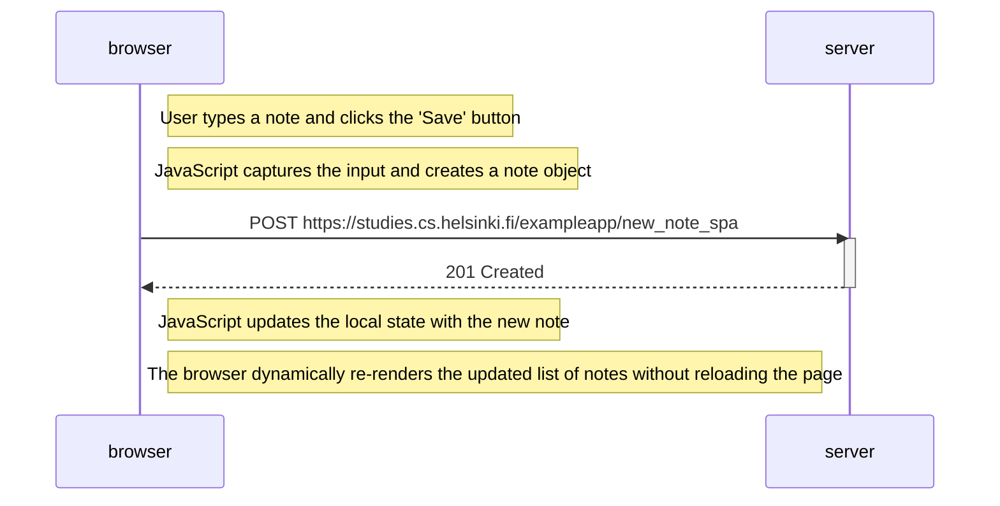

```mermaid
sequenceDiagram
    participant browser
    participant server

    Note right of browser: User types a note and clicks the 'Save' button

    Note right of browser: JavaScript captures the input and creates a note object

    browser->>server: POST https://studies.cs.helsinki.fi/exampleapp/new_note_spa
    activate server
    server-->>browser: 201 Created
    deactivate server

    Note right of browser: JavaScript updates the local state with the new note

    Note right of browser: The browser dynamically re-renders the updated list of notes without reloading the page
```
